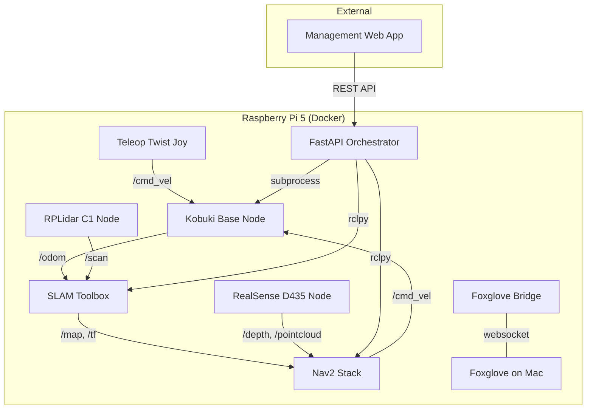

## Current Working State

- **Kobuki base** communicates over ROS2 via Docker container (udev rules for `/dev/kobuki` and `/dev/rplidar` on host)
- **SLAM Toolbox** works with RPLidar C1 — mapping mode and localization mode both functional
- **URDF** rebuilt with correct transforms; Foxglove visualization working (note: up-axis flipped in Foxglove Scene settings)
- **PS4 DualShock 4** teleoperation via Bluetooth using `teleop_twist_joy` and `ros-humble-joy`
- **Power distribution** solved: USB splitter providing 5V/5A directly from the USB system
- **Foxglove Bridge** is current `/cmd_vel` publisher; joystick coexists without conflict
- **FastAPI orchestrator** (~350 lines) with state machine, rclpy integration, subprocess management for launch files, REST endpoints for mapping/localization/Nav2/goal-sending/dock-return
- **Docker multi-container setup** with separate bringup, slam, and sensor containers; `kobuki_ros_interfaces` installed in slam container for topic visibility
- **Packages separated**: bringup, slam split out from upstream collab robotics code; foxglove bridge included in slam package

### Key Configuration Details

| Item | Detail |
|------|--------|
| Compute | Raspberry Pi 5, Ubuntu 24.x, 1TB NVMe (boot priority: NVMe → SSD) |
| ROS Distro | ROS2 Humble (in Docker) |
| Base | Kobuki (`ros2 launch kobuki_node kobuki_node.launch.py`) |
| LiDAR | RPLidar C1 via Slamtec sllidar_ros2 — use blue SuperSpeed USB ports |
| Camera (*NOT USED YET/NOT INSTALLED YET*) | Intel RealSense D435 (librealsense installed via libuvc method for ARM) |
| Controller | PS4 DualShock 4 over Bluetooth |
| UPS | Geekworm X1202/X120X |
| Orchestrator (*NOT TESTED YET*) | FastAPI service, sits outside ROS2, uses rclpy to interact with nodes |
| Visualization | Foxglove Bridge (websocket from Mac) |
| Source Repo | Based on CollaborativeRoboticsLab/kobuki GitHub repo, forked to auginator/kobuki |

### PS4 Controller Axis/Button Mapping (Verified)

This kernel exposes L2/R2 as analog axes, shifting button indices:

| Control | Mapping |
|---------|---------|
| Left Stick X | Axis 0 |
| Left Stick Y | Axis 1 |
| Right Stick X | Axis 2 |
| Right Stick Y | Axis 3 |
| L2 Analog | Axis 4 |
| R2 Analog | Axis 5 |
| L1 | Button 9 |
| R1 | Button 10 |

> Always verify with `ros2 topic echo /joy` — don't trust standard docs.

---

## Architecture Overview

---