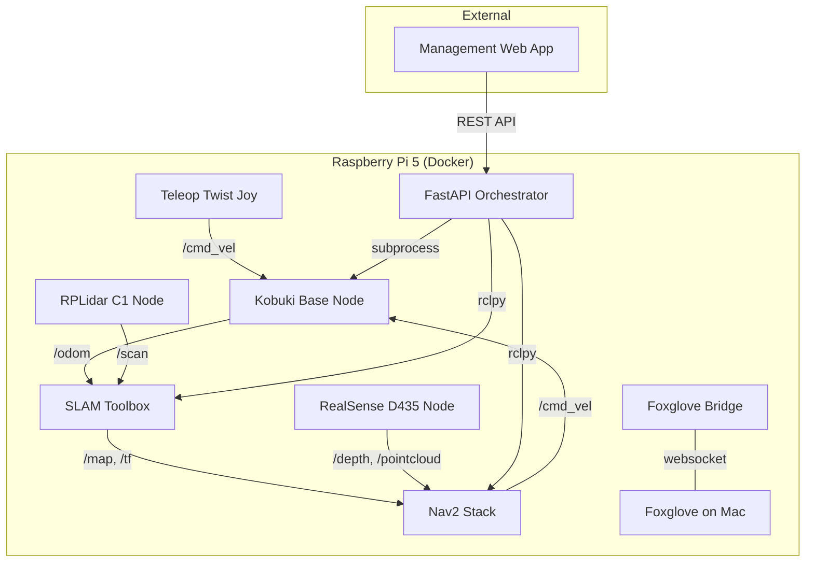

# CLAUDE.md

This file provides guidance to Claude Code (claude.ai/code) when working with code in this repository.

## Project Overview

An autonomous mobile robot built on a Kobuki base with a Raspberry Pi 5, running ROS2 Humble in Docker. The system currently supports SLAM-based mapping and localization via RPLidar C1, PS4 controller teleoperation, and a FastAPI orchestrator for managing robot operations. The next milestones are Nav2 autonomous navigation, RealSense D435 integration, and a management web application.

## Build & Run Commands

<!-- How to build, run, test. Docker commands, colcon commands, etc. -->

### Build
```bash
# Docker build commands here
```

### Run
```bash
# Docker compose / launch commands here
```

### Test
```bash
# How to run tests
```

## Architecture



### Containers
<!-- Which Docker containers exist and what they run -->
The robot is run as a Docker compose network (see @compose.yaml), with the following services
- zenoh_router: We are using Zenoh as Robot Middleware (RMW). This is the router service.
- kobuki: Bringup image for the kobuki base
- lidar_node: SLAM/Lidar/Foxglove Bridge/Joystick node - the idea is to consolidate the mapping/visualization code here
- orchestrator: Python ROS2 application, orchestrates lower level robot modes/behavior

### ROS2 Packages
<!-- Key packages in src/, what each does -->
- ros-humble-action-msgs
- ros-humble-foxglove-bridge
- ros-humble-geometry-msgs
- ros-humble-joint-state-publisher
- ros-humble-joy
- ros-humble-kobuki-ros-interfaces
- ros-humble-nav2-behaviors
- ros-humble-nav2-bringup
- ros-humble-nav2-bt-navigator
- ros-humble-nav2-controller
- ros-humble-nav2-core
- ros-humble-nav2-costmap-2d
- ros-humble-nav2-lifecycle-manager
- ros-humble-nav2-map-server
- ros-humble-nav2-msgs
- ros-humble-nav2-navfn-planner
- ros-humble-nav2-planner
- ros-humble-nav2-regulated-pure-pursuit-controller
- ros-humble-nav2-velocity-smoother
- ros-humble-nav2-waypoint-follower
- ros-humble-rmw-zenoh-cpp
- ros-humble-robot-state-publisher
- ros-humble-slam-toolbox
- ros-humble-teleop-twist-joy
- ros-humble-xacro

### Orchestrator
<!-- FastAPI orchestrator: where it lives, how it interacts with ROS2 -->
- Source: @orchestrator/robot_orchestrator.py
- Container: @orchestrator.Dockerfile

The Orchestrator is our highest level abstraction, serving as a central control system for managing the robot behavior, allowing us to switch between different modes, and use ROS to make high level calls (e.g. mapping/localization/NAV2 calls).

## Key Configuration

<!-- Important config files, parameters, topic/frame names -->

## Development Notes

<!-- Robot vs dev machine workflow, how to verify changes, common pitfalls -->
- Note that the host machine we are running on is NOT the robot, and cannot be used to test directly. Always ask user to validate changes that must be done on the robot.

## Known Gotchas

<!-- Things that commonly trip people up -->
