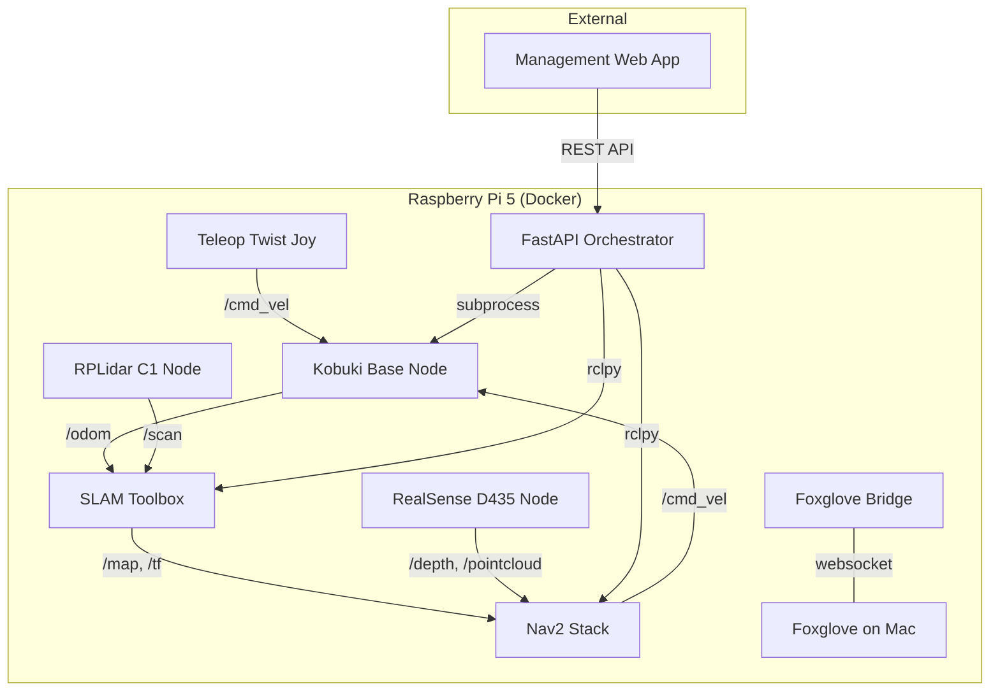
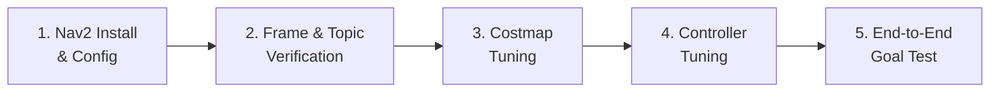
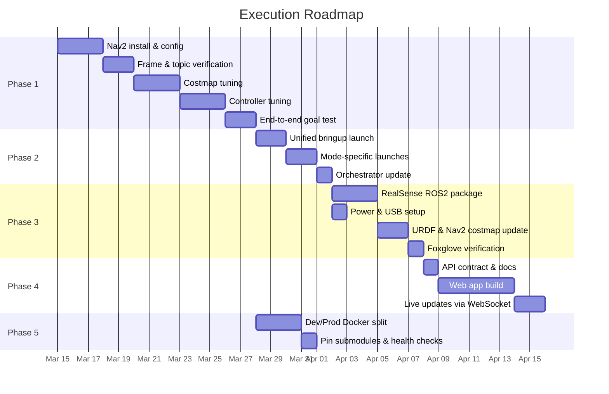

# Kobuki Autonomous Robot — Claude Code Handoff Plan

## Project Summary

An autonomous mobile robot built on a Kobuki base with a Raspberry Pi 5, running ROS2 Humble in Docker. The system currently supports SLAM-based mapping and localization via RPLidar C1, PS4 controller teleoperation, and a FastAPI orchestrator for managing robot operations. The next milestones are Nav2 autonomous navigation, RealSense D435 integration, and a management web application.

---

## Current Working State

### What's Done and Proven

- **Kobuki base** communicates over ROS2 via Docker container (udev rules for `/dev/kobuki` and `/dev/rplidar` on host)
- **SLAM Toolbox** works with RPLidar C1 — mapping mode and localization mode both functional
- **URDF** rebuilt with correct transforms; Foxglove visualization working (note: up-axis flipped in Foxglove Scene settings)
- **PS4 DualShock 4** teleoperation via Bluetooth using `teleop_twist_joy` and `ros-humble-joy`
- **Power distribution** solved: USB splitter providing 5V/5A directly from the USB system
- **Foxglove Bridge** is current `/cmd_vel` publisher; joystick coexists without conflict
- **FastAPI orchestrator** (~350 lines) with state machine, rclpy integration, subprocess management for launch files, REST endpoints for mapping/localization/Nav2/goal-sending/dock-return
- **Docker multi-container setup** with separate bringup, slam, and sensor containers; `kobuki_ros_interfaces` installed in slam container for topic visibility
- **Packages separated**: bringup, slam split out from upstream collab robotics code; foxglove bridge included in slam package

### Key Configuration Details

| Item | Detail |
|------|--------|
| Compute | Raspberry Pi 5, Ubuntu 24.x, 1TB NVMe (boot priority: NVMe → SSD) |
| ROS Distro | ROS2 Humble (in Docker) |
| Base | Kobuki (`ros2 launch kobuki_node kobuki_node.launch.py`) |
| LiDAR | RPLidar C1 via Slamtec sllidar_ros2 — use blue SuperSpeed USB ports |
| Camera (*NOT USED YET/NOT INSTALLED YET*) | Intel RealSense D435 (librealsense installed via libuvc method for ARM) |
| Controller | PS4 DualShock 4 over Bluetooth |
| UPS | Geekworm X1202/X120X |
| Orchestrator (*NOT TESTED YET*) | FastAPI service, sits outside ROS2, uses rclpy to interact with nodes |
| Visualization | Foxglove Bridge (websocket from Mac) |
| Source Repo | Based on CollaborativeRoboticsLab/kobuki GitHub repo, forked to auginator/kobuki |

### PS4 Controller Axis/Button Mapping (Verified)

This kernel exposes L2/R2 as analog axes, shifting button indices:

| Control | Mapping |
|---------|---------|
| Left Stick X | Axis 0 |
| Left Stick Y | Axis 1 |
| Right Stick X | Axis 2 |
| Right Stick Y | Axis 3 |
| L2 Analog | Axis 4 |
| R2 Analog | Axis 5 |
| L1 | Button 9 |
| R1 | Button 10 |

> Always verify with `ros2 topic echo /joy` — don't trust standard docs.

---

## Architecture Overview



---

## Execution Plan

### Phase 1: Nav2 Integration

Nav2 is the top priority. A five-phase plan is already in progress. Use the Regulated Pure Pursuit controller configured for Kobuki's differential drive.



**Tasks:**

1. **Install Nav2 packages** in the slam/navigation Docker container
   - `apt-get install ros-humble-nav2-bringup ros-humble-nav2-*`
   - Create a `nav2_params.yaml` with Regulated Pure Pursuit controller settings
2. **Verify frame names and topic remapping** — these are the #1 integration failure point
   - Confirm `odom` frame, `base_link` frame, `map` frame all resolve correctly in TF tree
   - Confirm `/cmd_vel` topic remapping matches what Kobuki base expects
   - Use `ros2 run tf2_tools view_frames` to dump the frame tree and validate
3. **Configure costmaps**
   - Global costmap: use the saved SLAM map
   - Local costmap: RPLidar `/scan` as observation source
   - Later: add RealSense depth as second observation source
4. **Tune controller parameters** — start conservative
   - Max linear velocity: ~0.2 m/s initially
   - Max angular velocity: ~0.5 rad/s initially
   - Goal tolerance: generous at first (0.25m xy, 0.25rad yaw)
5. **Create Nav2 launch file** and integrate with orchestrator
   - Add `nav2_bringup` launch to orchestrator's subprocess management
   - Wire up the `/navigate_to_pose` action client in the orchestrator
   - Test end-to-end: orchestrator REST call → Nav2 goal → robot moves

**Gotchas to watch for:**
- `cmd_vel` topic remapping between Nav2 and Kobuki base
- Frame name mismatches (`base_footprint` vs `base_link`)
- SLAM Toolbox must be in localization mode (not mapping mode) when Nav2 is active

---

### Phase 2: Launch File Consolidation

Currently multiple shells / launch files are needed. Consolidate into a clean hierarchy.

**Tasks:**

1. **Create a unified bringup launch file** (`robot_bringup.launch.py`) that starts:
   - Kobuki base node
   - RPLidar node
   - Robot state publisher (URDF)
   - Static transform publishers
   - Foxglove bridge
2. **Create mode-specific launch files** that include bringup + mode:
   - `mapping.launch.py` — bringup + SLAM Toolbox in mapping mode + teleop
   - `navigation.launch.py` — bringup + SLAM Toolbox in localization mode + Nav2
3. **Update the FastAPI orchestrator** to use these consolidated launch files instead of managing individual nodes
4. **Update `docker-compose.yml`** — consider whether slam and nav should be same container or separate
   - Recommendation: same container for slam + nav (they share map data and TF), separate container for bringup (base + sensors)

---

### Phase 3: RealSense D435 Integration

The camera is physically available and librealsense is installed on the host. Needs ROS2 integration.

**Tasks:**

1. **Add `realsense2_camera` ROS2 package** to the Docker image
   - `apt-get install ros-humble-realsense2-camera` (if available for ARM), otherwise build from source
   - The libuvc installation method was used for librealsense — verify the ROS wrapper can find it
2. **Power**: replicate the USB splitter solution used for LiDAR (5V/5A from USB system)
   - Use blue SuperSpeed USB port
3. **Add RealSense launch** to bringup, publishing:
   - `/camera/depth/image_rect_raw`
   - `/camera/depth/camera_info`
   - `/camera/color/image_raw` (optional, for visualization)
4. **Add depth-to-pointcloud or depthimage-to-laserscan** for Nav2 obstacle layer
   - `depthimage_to_laserscan` is simpler and lighter for a 2D navigation setup
   - Add as second observation source in Nav2 local costmap
5. **Update URDF** with RealSense camera link and correct transform relative to `base_link`
6. **Verify in Foxglove** — depth image and/or pointcloud visible and aligned with LiDAR scan

---

### Phase 4: Management Web Application

A web UI to interface with the FastAPI orchestrator.

**Tasks:**

1. **Define the API contract** — document all orchestrator REST endpoints:
   - `POST /mapping/start` — start SLAM mapping mode
   - `POST /mapping/stop` — save map and stop
   - `POST /joystick/start` — start joystick teleoperation overlay
   - `POST /joystick/stop` — stop joystick teleoperation overlay
   - `POST /localization/start` — start localization with saved map
   - `POST /navigation/start` — launch Nav2
   - `POST /navigation/goal` — send a navigation goal `{x, y, theta}`
   - `POST /dock/return` — return to dock
   - `GET /status` — current state machine state, battery, sensor health
2. **Build a simple React web app** (or similar) with:
   - State indicator (idle, mapping, localizing, navigating)
   - Map display (consume map image from orchestrator or Foxglove)
   - Click-to-navigate on map (translate pixel coords to map coords, send goal)
   - Start/stop controls for each mode
   - Teleop joystick widget for manual control
3. **Serve from the Pi** — either from the orchestrator (FastAPI static files) or a separate lightweight container
4. **WebSocket for live updates** — robot pose, state transitions, battery level

---

### Phase 5: Docker & Dev Workflow Improvements

Journal notes from Nov 2025 outline a desired Docker restructure that hasn't been completed.

**Tasks:**

1. **Dev Docker image** — does not clean up build artifacts, volume-mounts `src/` for fast iteration
   - Explore `docker compose watch` for auto-rebuild on file changes
2. **Prod Docker image** — clean multi-stage build, minimal image size
3. **Pin submodule versions** (already documented in journal) to ensure reproducible builds:
   - `cmd_vel_mux`: `e4188d3`
   - `kobuki_core`: `133af0a`
   - `kobuki_ros`: `b21a5ab`
   - `kobuki_ros_interfaces`: `7711d4f`
   - `kobuki_velocity_smoother`: `839122c`
4. **Add health checks** to docker-compose services
5. **Source ROS setup in `.bashrc`** inside containers (noted as a friction point in journal)

---

## Known Issues & Gotchas

| Issue | Detail | Mitigation |
|-------|--------|------------|
| USB detection | Kobuki base sometimes requires re-seating USB cable on startup | May be related to udev daemon restart in entrypoint; investigate removing it |
| Power brownouts | LiDAR (and likely RealSense) can't be powered from Pi USB alone | USB splitter pulling 5V/5A from UPS system directly |
| Battery indicators | LED bars on battery shields are misleading for actual available power | Use mains power during development |
| Foxglove up-axis | Model renders incorrectly without flipping up-axis in Scene settings | Flip in Foxglove; investigate URDF `up_axis` convention |
| macOS Docker | No USB device passthrough — all hardware work must be on the Pi | Dev on Pi, visualization from Mac via Foxglove websocket |
| L2/R2 as axes | Kernel exposes L2/R2 as analog axes not buttons, shifts all button indices | Always verify via `ros2 topic echo /joy` |

---

## File Structure (Target)

```
kobuki_ws/
├── docker-compose.yml
├── docker-compose.dev.yml          # Dev overrides (volume mounts, no cleanup)
├── docker/
│   ├── Dockerfile.bringup          # Base + sensors
│   ├── Dockerfile.nav              # SLAM + Nav2
│   └── Dockerfile.orchestrator     # FastAPI
├── src/
│   ├── bringup/
│   │   ├── launch/
│   │   │   ├── robot_bringup.launch.py
│   │   │   ├── mapping.launch.py
│   │   │   └── navigation.launch.py
│   │   ├── config/
│   │   │   ├── nav2_params.yaml
│   │   │   └── slam_params.yaml
│   │   └── urdf/
│   │       └── kobuki.urdf.xacro
│   ├── slam/
│   │   └── launch/
│   │       ├── slam_mapping.launch.py
│   │       └── slam_localization.launch.py
│   └── orchestrator/
│       ├── main.py                 # FastAPI app (~350 lines)
│       └── requirements.txt
├── maps/                           # Saved SLAM maps
├── webapp/                         # Management web app
│   ├── src/
│   └── package.json
└── CLAUDE_CODE_HANDOFF_PLAN.md     # This file
```

---

## Priority Order



---

## Instructions for Claude Code

When working on this project:

0. **Robot Code is run on robot, not on same host as Claude Code AI** - ask me to run any commands you need to run to verify each step on the robot and paste result to you in chat.
1. **Always verify assumptions interactively** before committing to implementation — use `ros2 topic list`, `ros2 topic info`, `echo $ROS_DISTRO`, etc.
2. **Deliver complete, production-ready files** — not partial examples or pseudocode.
3. **All documentation in Markdown, all diagrams as Mermaid.**
4. **The FastAPI orchestrator sits outside ROS2** but uses rclpy — don't create lifecycle chicken-and-egg problems.
5. **Frame names and `cmd_vel` topic remapping** are the most common Nav2 integration failures — verify these first.
6. **Test on mains power** during development — battery indicators lie.
7. **Reference repo**: CollaborativeRoboticsLab/kobuki on GitHub.
8. **Nav2 controller**: Regulated Pure Pursuit, configured for differential drive, conservative velocities initially.
