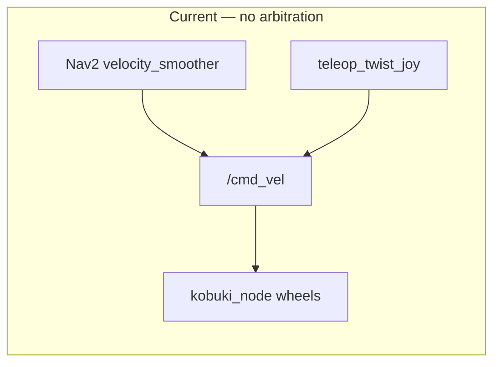
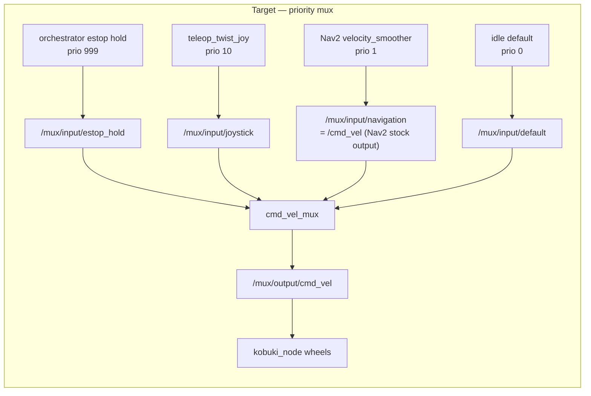

# cmd_vel_mux wiring — design spec

**Status:** approved, ready to implement
**Date:** 2026-07-28
**Ticket:** KOB-117 (Regulated Pure Pursuit controller + cmd_vel mux/smoother routing)

## Context

The Kobuki base subscribes to `/cmd_vel` (the stock `kobuki_node.launch.py`
remaps `/commands/velocity → /cmd_vel`). Today multiple sources — Nav2's
`velocity_smoother`, `teleop_twist_joy`, and others — all publish onto `/cmd_vel`
with **no arbitration**. Consequences:

- **The joystick cannot preempt autonomous motion.** During a Nav2 run the only
  way to abort is `POST /estop`, which kills the whole stack. There is no way for
  a human to take over smoothly.
- Teleop and autonomy cannot coexist safely.

This is a live safety gap, not a feature. The repo already vendors a
`cmd_vel_mux` package (priority-based Twist multiplexer) plus mux-aware base and
joyop launch variants, but none of it is wired into the deployed bringup, and the
mux's configured input topics do not match what anything currently publishes.

**Outcome:** route every command source through `cmd_vel_mux` so a
higher-priority source preempts a lower-priority one. The joystick (priority 10)
preempts navigation (priority 1) by construction, and a dedicated estop-hold
channel (priority 999) can force a stop against any source.

## Current vs. target topology

## Design decisions (settled)

1. **Mux placement — in `augs_bringup` (always-on).** The base subscribes to the
   mux output, so the mux is core plumbing that must be up 100% of the time the
   wheels are (like `robot_state_publisher`), not an orchestrator-managed optional
   stack. If it dies, no source reaches the wheels and the robot stops.
2. **Mux sits *after* Nav2's `velocity_smoother`.** Nav2's smoother is its own
   safety/comfort layer on its own output; the mux arbitrates between *sources*.
   Teleop deliberately bypasses smoothing — a human hand needs immediate response,
   not an accel-limited ramp.
3. **Nav2 stays 100% stock.** Rather than retarget Nav2's output, we move the
   *base* one hop downstream and point the mux's `navigation` input at Nav2's
   existing smoothed `/cmd_vel`. No forked `navigation_launch.py`.
4. **Preemption is by priority.** joystick (10) > navigation (1) > default (0).
   This is the KOB-117 fix — the joystick wins the arbitration instead of losing a
   dogpile.
5. **Estop is an assert/clear pair** using a priority-999 hold channel (see below).

## Topic / priority table

The mux hardcodes its **output** as `/mux/output/cmd_vel`
(`cmd_vel_mux/src/cmd_vel_mux.cpp:94`). Inputs are configured in
`cmd_vel_mux/config/cmd_vel_mux_params.yaml`.

| Source | Publishes to | Priority | Timeout | Notes |
|---|---|---|---|---|
| Orchestrator estop hold | `mux/input/estop_hold` | **999** | 0.3 s | zeros while estopped |
| Teleop (`teleop_twist_joy`) | `mux/input/joystick` | 10 | 0.1 s | unsmoothed, direct human control |
| Nav2 (post-`velocity_smoother`) | `mux/input/navigation` → `/cmd_vel` | 1 | 0.5 s | Nav2 stock output |
| Idle / default | `mux/input/default` | 0 | 0.1 s | lowest priority |
| **Mux output** | `/mux/output/cmd_vel` | — | — | base subscribes here |

## Estop hold mechanism

The orchestrator is already an rclpy `Node`. Add:

- A publisher on `mux/input/estop_hold` and a **timer callback on the rclpy
  executor thread** that publishes `Twist(0,0)` at ~10 Hz while `state.estopped`
  is `True`. Publishing from the executor-thread timer (not a FastAPI handler
  thread) avoids the known rclpy-from-handler-thread hazard.
- `POST /estop`: sets `state.estopped = True` (the handler only flips the flag)
  **and** still calls `launch_stop_all()`. Belt-and-suspenders — the hold forces
  zeros even against a stuck publisher; killing sources also stops Nav2 planning.
- **New** `POST /estop/clear`: sets `state.estopped = False`. The timer stops
  publishing, the 0.3 s `estop_hold` timeout lapses, and lower-priority sources can
  drive again. Required because a latched priority-999 hold otherwise blocks
  *everything*, including teleop, until explicitly released.

`teleop_enabled` remains orchestrator bookkeeping (which nodes are up). It does
**not** gate the mux — priority does.

## Files to modify

| File | Change |
|---|---|
| `augs_bringup/launch/augs_kobuki_node.launch.py` | Include `cmd_vel_mux` node; swap the stock `kobuki_node.launch.py` include for `kobuki_node_mux.launch.py` (already remaps `/commands/velocity → /mux/output/cmd_vel`, so the base sits downstream of the mux). |
| `cmd_vel_mux/config/cmd_vel_mux_params.yaml` | Add `estop_hold` subscriber (topic `mux/input/estop_hold`, prio 999, timeout 0.3); set `navigation_stack` topic to `/cmd_vel` (Nav2 stock output) with prio 1; keep `joystick` prio 10, `default` prio 0; align timeouts with the table above. |
| `slam/launch/joy_teleop.launch.py` | Remap `teleop_twist_joy`'s `cmd_vel → /mux/input/joystick`. |
| `orchestrator/robot_orchestrator.py` | Add `estop_hold` publisher + executor-thread timer gated on `state.estopped`; `/estop` sets `state.estopped=True` and still stops stacks; add `POST /estop/clear` that sets `state.estopped=False`. Add `estopped: bool = False` to state and surface it in `/status`. |
| `augs_bringup/CMakeLists.txt` | Ensure `cmd_vel_mux` is a build/exec dependency available at bringup (verify it is built into the base image). |

**Reuse — already present, do not rewrite:**
- `kobuki_ros/kobuki_node/launch/kobuki_node_mux.launch.py` — base variant that
  remaps the wheels' velocity input to `/mux/output/cmd_vel`.
- `cmd_vel_mux/launch/cmd_vel_mux.launch.py` — loads the params file and starts the
  mux node.

## Assumptions to verify interactively (per repo working style)

1. Nav2's `velocity_smoother` publishes final `/cmd_vel` in the deployed
   `nav2_bringup navigation_launch.py`. Confirm on the robot:
   `ros2 node info /velocity_smoother` and `ros2 topic info /cmd_vel -v`.
2. `cmd_vel_mux` (the executable `cmd_vel_mux_node`) is present in the bringup
   image; if not, add it to the bringup build.
3. `kobuki_node_mux.launch.py` params match the deployed `kobuki_node.launch.py`
   (same `kobuki_node_params.yaml`, `publish_tf`).

## Verification (end-to-end, on the robot)

1. **Single publisher:** with bringup up, `ros2 topic info /mux/output/cmd_vel -v`
   shows only the mux publishing, and `ros2 topic info /cmd_vel -v` shows Nav2
   (when running) as a publisher and the mux as a subscriber — not the base.
2. **Preemption:** start autonomy, send a goal, then drive with the joystick —
   the robot must follow the stick immediately and ignore Nav2 while the stick is
   active, then hand back to Nav2 within ~0.1 s of releasing it.
3. **Estop hold:** while a source is actively publishing, `POST /estop` — the
   robot stops and stays stopped even though a source is publishing (mux active
   source = `estop_hold`). `ros2 topic echo /mux/output/cmd_vel` shows zeros.
4. **Estop clear:** `POST /estop/clear` — motion becomes possible again; a fresh
   teleop/nav command drives the base.
5. **Mux resilience:** the mux is up whenever the base container is up; killing
   any source never leaves a stale command driving the wheels.

## Out of scope

- Fixing the missing `odom → base_footprint` TF / "Kobuki: no data stream" base
  connection issue (separate — blocks mapping/localization, tracked separately).
- Nav2 controller tuning beyond the already-applied goal tolerances.
